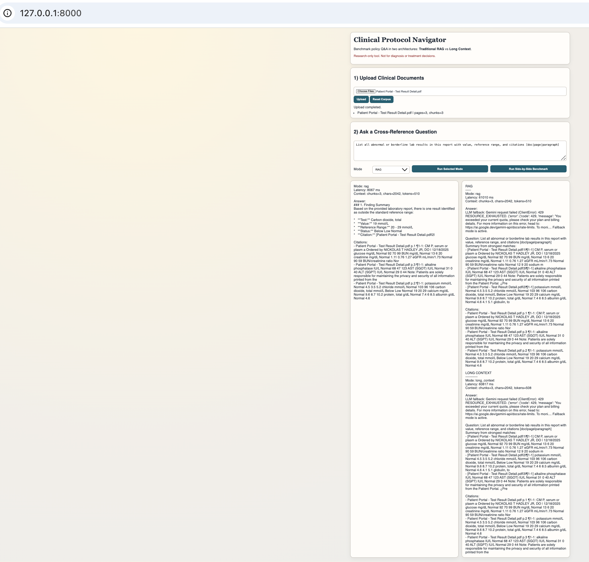

# Clinical Protocol Navigator (RAG vs Long Context)

A practical demo for healthcare policy analysis with two interchangeable answer architectures:

- `Mode A`: Traditional RAG (vector retrieval + answer from top chunks)
- `Mode B`: Long Context (full-corpus context up to configured size)
- `Gateway`: OpenClaw-compatible API endpoints + local OpenClaw worker service

The project is built to support a benchmark narrative for clinical protocol review, compliance drift checks, and citation-backed reasoning.

## What this demo does

- Upload multiple `.pdf`, `.txt`, or `.md` files (clinical guidelines, internal policy docs, CMS updates).
- Ask a cross-reference question in either mode.
- Run side-by-side benchmark to compare:
  - latency
  - context size
  - citation coverage
- Citation granularity includes `doc + page + paragraph range`.
- Optional governance controls: PII redaction, RBAC, immutable hash-chained audit logs.

## Safety note

This is a research prototype. It is **not** a diagnostic or treatment system.
Use de-identified documents and route results through clinical/legal review before operational use.

## Local run

```bash
python3 -m venv .venv
source .venv/bin/activate
pip install -r requirements.txt
cp .env.example .env
uvicorn app.main:app --reload --port 8000
```

Open [http://localhost:8000](http://localhost:8000).

## Environment variables

- `GEMINI_API_KEY`: optional. If omitted, deterministic fallback responses are used.
- `GEMINI_MODEL`: default `gemini-3-flash-preview`.
- `GEMINI_RETRY_MAX_ATTEMPTS`: max retries for retryable Gemini failures (for example 429).
- `GEMINI_RETRY_INITIAL_DELAY_SECONDS`: first retry delay in seconds.
- `GEMINI_RETRY_BACKOFF_MULTIPLIER`: exponential backoff multiplier between retries.
- `GEMINI_RETRY_MAX_DELAY_SECONDS`: max retry delay cap.
- `MAX_CONTEXT_CHARS`: maximum long-context size sent to the model.
- `MAX_CONTEXT_TOKENS`: token budget for long-context mode (primary limiter).
- `CONTEXT_PROFILE`: `balanced` or `stress`. `stress` uses the stress limits below.
- `MAX_CONTEXT_CHARS_STRESS`: long-context char budget for stress mode.
- `MAX_CONTEXT_TOKENS_STRESS`: long-context token budget for stress mode (set near 1M+ for full-window tests).
- `RAG_TOP_K`: default retrieval chunk count (currently surfaced via request payload).
- `ENABLE_CONTEXT_CACHE`: enables Gemini context cache attempts for long-context queries.
- `CONTEXT_CACHE_TTL_MINUTES`: cache entry TTL.
- `CONTEXT_CACHE_MIN_CHARS`: minimum context size before cache attempts.
- `CONTEXT_CACHE_INDEX_PATH`: local cache index file path.
- `ENABLE_PII_REDACTION`: redact common PII patterns during ingestion.
- `RBAC_ENABLED`: enable role-based access checks.
- `RBAC_HEADER_NAME`: request header for caller role (default `x-user-role`).
- `RBAC_DEFAULT_ROLE`: default role when header is missing.
- `AUDIT_LOG_PATH`: append-only audit log output path.
- `AUDIT_HASH_SEED`: hash-chain seed for tamper detection.
- `BENCHMARK_INTER_MODE_DELAY_SECONDS`: optional wait between RAG and Long Context calls in `/api/benchmark`.
- Python compatibility note: this repo runs on Python `3.8+`, but Gemini SDK install is enabled only on Python `3.9+` in `requirements.txt`.

## Suggested healthcare benchmark script

1. Upload a baseline internal protocol corpus + a new regulatory update.
2. Ask multi-hop questions that depend on distant sections.
3. Run `/api/benchmark` repeatedly and log outputs.
4. Compare where RAG misses nuanced constraints but long context retains them.
5. Track citation quality by manual spot checks.

Example question:

`Does our internal ICU sepsis policy conflict with the 2026 CMS quality reporting language, and what sections require remediation?`

## API endpoints

- `GET /api/health`
- `GET /api/documents`
- `POST /api/documents/upload`
- `POST /api/ask`
- `POST /api/benchmark`
- `GET /api/openclaw/status`
- `GET /api/openclaw/handshake`
- `POST /api/openclaw/sync-folder`
- `POST /api/openclaw/ask`
- `GET /api/audit/verify`

## OpenClaw integration (what is included)

This repo includes:

- OpenClaw-compatible API endpoints on the FastAPI backend.
- A local runnable worker service at `openclaw/service.py` that monitors a folder and calls those endpoints.

You can still point an external OpenClaw framework at the same endpoints if preferred.

- folder watch -> call `POST /api/openclaw/sync-folder`
- messaging question -> call `POST /api/openclaw/ask`

### Example: sync monitored folder

```bash
curl -X POST http://127.0.0.1:8000/api/openclaw/sync-folder \
  -H "Content-Type: application/json" \
  -H "x-openclaw-secret: change-me" \
  -d '{"folder_path":"/Users/you/HCA_Clinical_Protocols"}'
```

Example response:

```json
{
  "folder_path": "/Users/you/HCA_Clinical_Protocols",
  "ingested_count": 2,
  "documents": [
    {"doc_id": "...", "doc_name": "Sepsis-Policy.pdf", "pages": 100, "chunks": 260}
  ]
}
```

### Example: handshake check

```bash
curl -X GET http://127.0.0.1:8000/api/openclaw/handshake \
  -H "x-openclaw-secret: change-me"
```

### Example: ask through OpenClaw gateway

```bash
curl -X POST http://127.0.0.1:8000/api/openclaw/ask \
  -H "Content-Type: application/json" \
  -H "x-openclaw-secret: change-me" \
  -d '{"question":"Does sepsis policy conflict with new CMS update?","mode":"long_context","top_k":8,"benchmark":true}'
```

### Run the local OpenClaw worker service

```bash
cd /Users/cpandirlapali/chaithanya-docs
source .venv311/bin/activate
python openclaw/service.py \
  --base-url http://127.0.0.1:8000 \
  --secret "<OPENCLAW_SHARED_SECRET>" \
  --watch-dir "/Users/cpandirlapali/chaithanya-docs/clinical_policies" \
  --poll-seconds 5
```

Send a benchmark question via the worker:

```bash
python openclaw/service.py \
  --base-url http://127.0.0.1:8000 \
  --secret "<OPENCLAW_SHARED_SECRET>" \
  --watch-dir "/Users/cpandirlapali/chaithanya-docs/clinical_policies" \
  ask --question "Summarize sepsis compliance deltas with citations." --benchmark
```

## Next hardening steps for enterprise use

- Policy graph extraction for better conflict detection beyond pure text Q&A.
- Enterprise auth integration (OIDC/SAML) behind RBAC.
- External WORM storage target for audit logs.
- Reviewer workflow integration for sign-off and remediation tracking.

## Benchmark Script

Run an automated 10-question benchmark and export CSV/JSONL artifacts:

```bash
cd /Users/cpandirlapali/chaithanya-docs
source .venv311/bin/activate
python benchmark_script.py
```

Options:

- `--base-url http://127.0.0.1:8000`
- `--top-k 8`
- `--questions-file /path/to/questions.txt`
- `--sleep-seconds 1.0`
- `--output-csv data/benchmark_runs/my_run.csv`

## Diagrams

- Architecture + UI diagrams for newsletter/reference: `docs/DIAGRAMS.md`
- Live run-screen layout diagram: `docs/UI_BENCHMARK_LAYOUT.md`

### Live UI Screenshot


