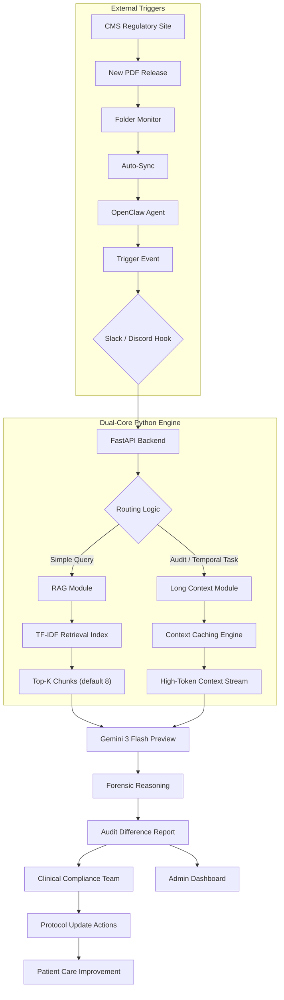
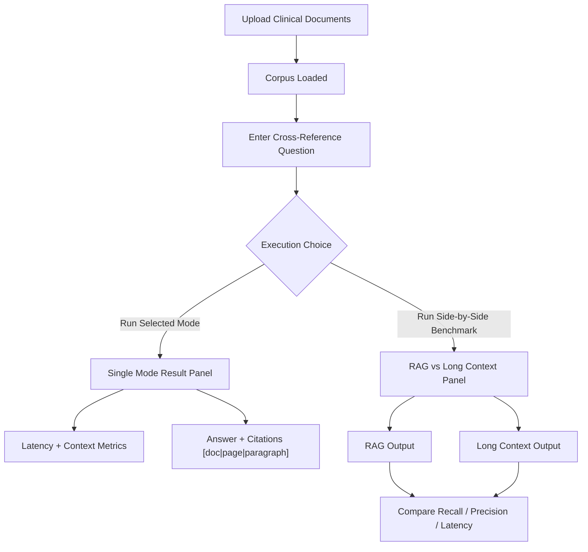

# Clinical Protocol Navigator Diagrams

## 1) End-to-End Architecture

## 2) UI Execution View (Run Mode + Benchmark)

## Notes

- Diagram 1 reflects the architecture used in this repository (OpenClaw-compatible trigger flow + dual execution engine).
- Diagram 2 reflects the current UI workflow and benchmark interaction model.
- The current retrieval backend is TF-IDF/cosine retrieval (not an external vector database service).
