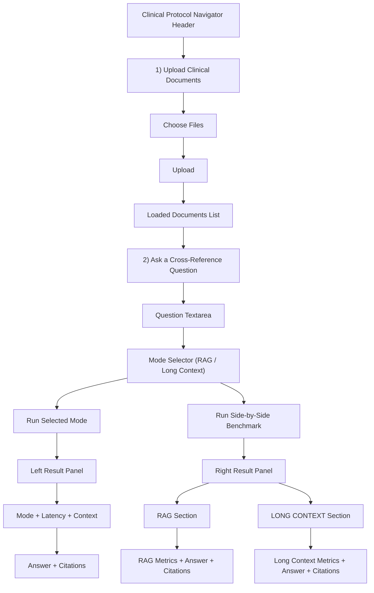

# UI Benchmark Layout (from Live Run Screen)

This diagram maps the exact interface flow shown in the live app screenshot:

## Interpretation

- Left panel represents the selected single-mode run output.
- Right panel represents combined benchmark output (`RAG` and `LONG CONTEXT`).
- Both views expose latency and context-size metrics, then answer and citation blocks.
